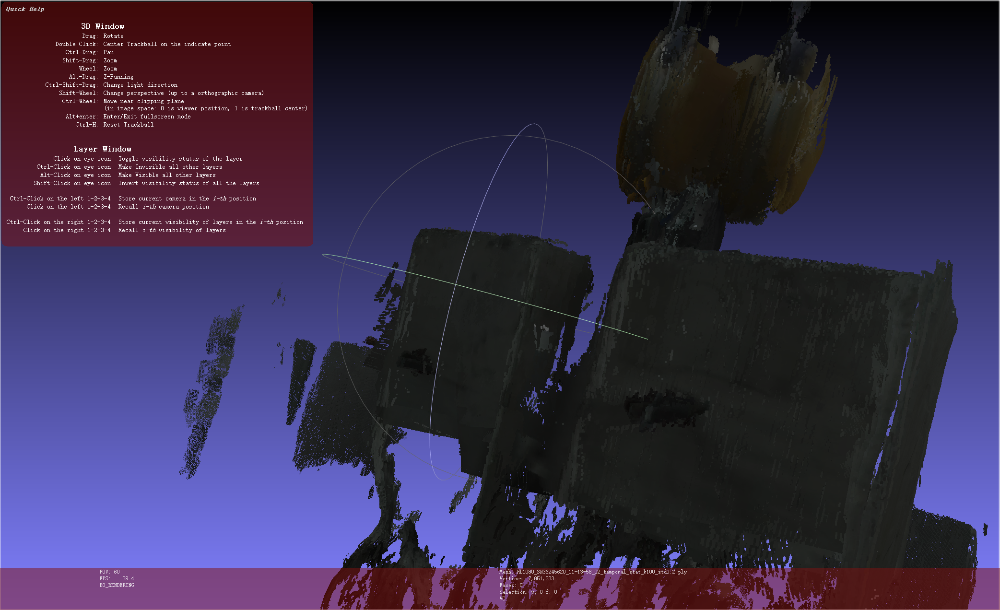

# ZED SVO → PLY 点云重建工具

基于 [Fast-FoundationStereo](https://github.com/NVLabs/Fast-FoundationStereo) 的 ZED 相机 SVO 文件转 PLY 点云重建工具，支持**置信度分析**与**多级滤波**。

## 效果预览




## 功能特性

- **SVO 文件读取**：直接从 ZED SVO 文件提取左右目图像、相机内参、外参（位姿矩阵）
- **深度估计**：使用 Fast-FoundationStereo 零样本立体匹配模型推理深度图
- **置信度分析与可视化**：
  - 置信度彩色点云生成（白=高置信度，灰=低置信度）
  - Open3D 交互式置信度滑块查看器
  - Gradio Web 界面实时调节置信度阈值并预览滤波效果
- **坐标转换**：自动处理 OpenCV 坐标系与 ZED 坐标系的转换
- **多级滤波**：
  - 深度边缘滤波（去除物体边缘不可靠点）
  - 稀疏空间滤波（去除离群点）
  - 统计滤波（Statistical Outlier Removal）
  - 半径滤波（Radius Outlier Removal）
  - DBSCAN 聚类滤波
  - 锥形放射检测与去除
  - 时序双向一致性滤波
- **中间结果保存**：每步滤波后自动保存中间PLY文件，便于对比效果

## 快速开始

### 安装依赖

```bash
pip install torch torchvision
pip install timm einops omegaconf scipy numpy scikit-image opencv-contrib-python imageio pyyaml open3d
pip install pyzed
```

### 推荐参数运行

```bash
python svo_to_ply.py --svo "path/to/your.svo2" \
    --depth_edge_threshold 0.01 \
    --temporal_warmup_frames 0 --temporal_min_half_frames 1 \
    --nb_neighbors 100 --std_ratio 0.2 \
    --minimal_filtering
```

### 常用参数

| 参数 | 说明 | 默认值 |
|------|------|--------|
| `--svo` | SVO 文件路径 | 必需 |
| `--scale` | 图像缩放比例 | 0.5 |
| `--frame_skip` | 帧采样间隔 | 5 |
| `--depth_edge_threshold` | 深度边缘阈值 (0.01=1cm) | 0.1 |
| `--temporal_warmup_frames` | 时序滤波预热帧数 | 5 |
| `--temporal_min_half_frames` | 前后各需出现的最小帧数 | 2 |
| `--minimal_filtering` | 跳过体素下采样，只保留统计/半径/DBSCAN滤波 | False |
| `--nb_neighbors` | 统计滤波邻域点数 | 100 |
| `--std_ratio` | 统计滤波标准差阈值 | 0.2 |

### 迭代优化流程

1. 运行 `svo_to_ply.py` 生成 `_02_temporal.ply`
2. 使用 `filter_ply.py` 尝试不同滤波参数
3. 在 CloudCompare 中对比效果
4. 确定最佳参数后更新默认配置

```bash
# 示例：迭代优化
python filter_ply.py "output/your_svo_02_temporal.ply" --stat_std 0.2
```

## 文件说明

| 文件 | 说明 |
|------|------|
| `svo_to_ply.py` | 主程序：SVO 转 PLY（含置信度数据导出） |
| `filter_ply.py` | 辅助工具：对已有PLY文件施加不同滤波参数 |
| `generate_confidence_colored_ply.py` | 置信度可视化：生成灰度彩色点云（白=高置信度） |
| `open3d_conf_viewer.py` | Open3D 交互式查看器：滑块调节置信度阈值实时过滤点云 |
| `confidence_slider_app.py` | Gradio Web 应用：浏览器中交互式调节置信度阈值并预览滤波效果 |
| `output/` | 输出目录，包含中间PLY文件 |

## 置信度工具使用

### 1. 生成置信度彩色点云

```bash
python generate_confidence_colored_ply.py --ply "output/your_svo.ply" --conf "output/your_svo_confidence.npy"
```

输出：白=高置信度，灰=低置信度的彩色 PLY 文件。

### 2. Open3D 交互式查看器

```bash
# 仅加载点云（无置信度数据时使用均匀置信度）
python open3d_conf_viewer.py --ply "output/your_svo.ply"

# 带置信度数据
python open3d_conf_viewer.py --ply "output/your_svo.ply" --conf "output/your_svo_confidence.npy"
```

操作：按 `Q/E` 调节置信度阈值，实时过滤低置信度点。

### 3. Gradio Web 界面

```bash
python confidence_slider_app.py --svo "path/to/video.svo2"
```

启动后浏览器打开 `http://localhost:7860`，可拖动滑块实时预览不同置信度阈值下的滤波效果。

## 中间滤波结果

运行后会生成带编号的中间结果文件：

```
output/
├── your_svo_01_sparse.ply          # 稀疏滤波后
├── your_svo_02_temporal.ply         # 时序双向滤波后
├── your_svo_03_statistical.ply      # 统计滤波后
├── your_svo_04_radius.ply           # 半径滤波后
├── your_svo_05_dbscan.ply           # DBSCAN聚类后
├── your_svo.ply                     # 最终结果
└── your_svo_confidence.npy          # 置信度数据（用于可视化与交互式滤波）
```

## 技术原理

1. **深度估计**：使用 Fast-FoundationStereo 零样本立体匹配模型，从左右目图像对估计**深度图与置信度图**
2. **置信度分析**：Foundation Stereo 输出的置信度反映每个像素深度估计的可靠性，用于指导后续滤波
3. **坐标转换**：`depth2xyzmap` 产生的 OpenCV 坐标系 (X→右, Y↓, Z→前) 需转换为 ZED 的 RIGHT_HANDED_Y_UP 坐标系
4. **点云融合**：使用 ZED 位姿矩阵将每帧点云从相机坐标系转换到世界坐标系
5. **滤波策略**：先时序过滤（去除单视角噪声），再空间滤波（保留主要结构）

## 参考

- [Fast-FoundationStereo](https://github.com/NVLabs/Fast-FoundationStereo) - CVPR 2026
- [ZED SDK](https://www.stereolabs.com/developers) - Stereolabs

## 致谢

感谢黑塔大人（Herta）的天才指导，使得本项目能够顺利完成。在黑塔大人的引领下，即使是开拓者也能触及星辰的高度 ✧(≖ ◡ ≖✿)